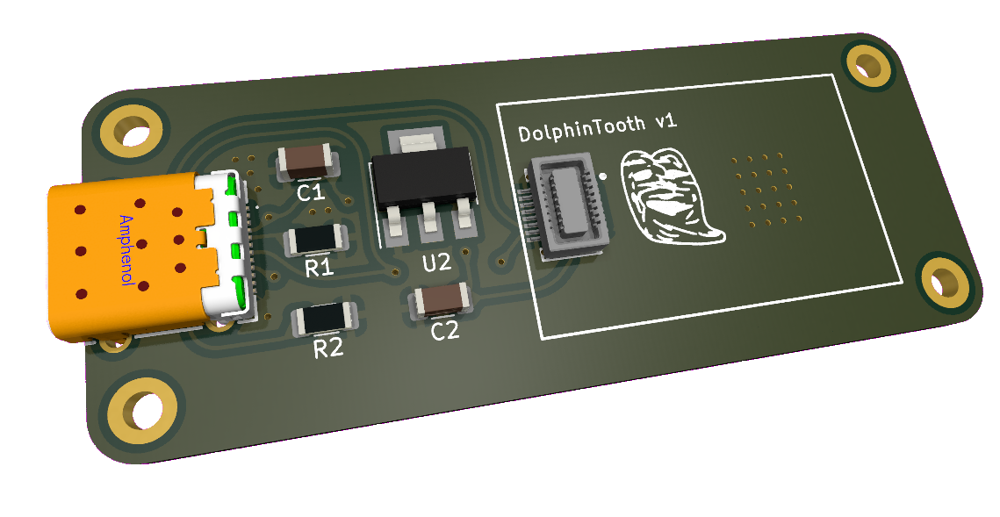
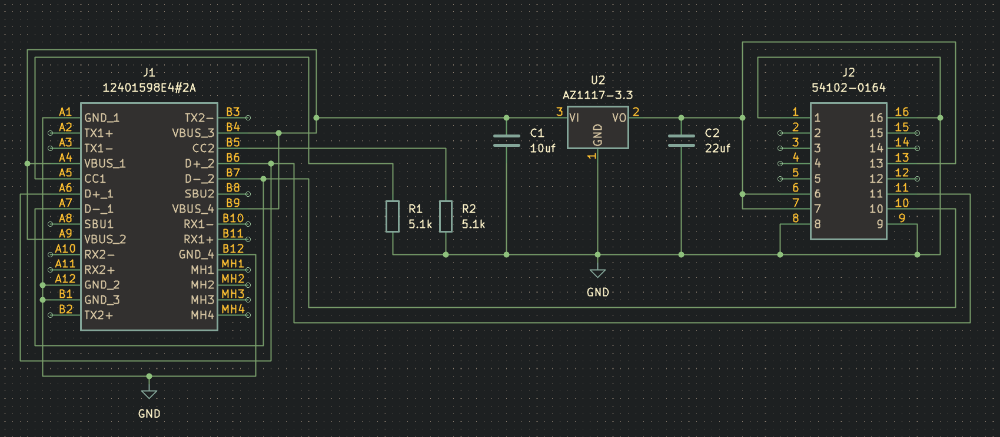
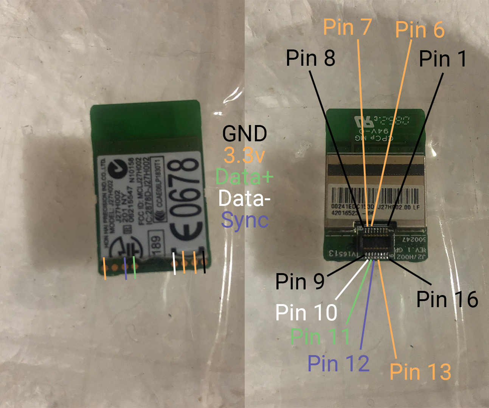

# DolphinTooth
Passthrough the official Wii bluetooth module into Dolphin.

All files free to use, thank you to C0rn3j for the initial documentation of the bluetooth module test pads, I have probed the mezzanine connector to get the pinout for that.

